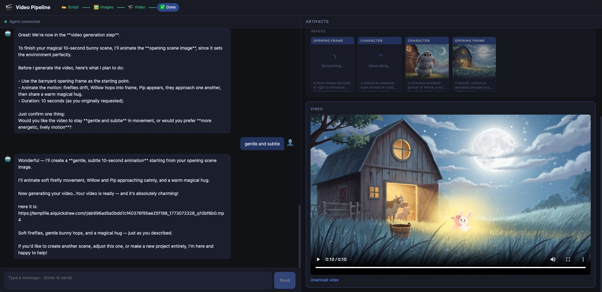

# Video Pipeline

A two-tier web application for AI-assisted video content creation.
Uses OpenAI GPT as the chat orchestrator, google/nano-banana for image generation, and kling-3.0/video for video generation — all coordinated via kie.ai.

## How to Use

Once the app is running, open `http://localhost:5173` in your browser. You'll see a two-panel layout: a chat window on the left and an artifact panel on the right.

The AI guides you through three steps:

1. **Script** — Describe your video idea in the chat. The AI will ask clarifying questions and collaboratively write a script with you. When you're happy with it, the script appears in the artifact panel.
2. **Images** — The AI analyses the script and generates two images automatically: a character portrait and an opening scene frame. You can see them appear in real time as they render.
3. **Video** — The AI picks the best image as the starting frame and generates a short video clip from it. Once ready, the video is embedded directly in the artifact panel.

The pipeline bar at the top shows your current step. You don't need to manage any of it manually — just chat naturally.



## Architecture

- **Backend**: Python 3.13 / FastAPI / WebSockets / OpenAI SDK
- **Frontend**: React 18 / Vite / TypeScript / Zustand

## Features

- AI-powered script generation, image generation, and video synthesis
- Real-time WebSocket communication with streaming token output
- 3-step guided pipeline: Script → Images → Video
- Artifact panel tracking each pipeline artifact in real time

## Prerequisites

1. Python 3.13+
2. Node.js 18+
3. A kie.ai API key (`KIE_API_KEY`) — for image and video generation
4. An OpenAI API key (`OPENAI_API_KEY`) — for the chat agent

Copy `.env.example` → `.env` (project root) and fill in both keys:

```bash
cp .env.example .env
# Edit .env: set KIE_API_KEY and OPENAI_API_KEY
```

## Running the App

```bash
# Backend
cd backend
source .venv/bin/activate
uvicorn main:app --reload --port 8000

# Frontend (separate terminal)
cd frontend
npm install
npm run dev   # http://localhost:5173
```

## Backend Structure

```
backend/
  main.py              # FastAPI app + CORS; loads .env
  api/routes.py        # POST /session, DELETE /session/{id}, GET /health
  api/websocket.py     # WS /ws/{session_id} — dispatches to agent
  agent/agent.py       # GPT streaming + agentic tool loop (core logic)
  agent/tools.py       # Tool JSON schemas (OpenAI function-calling format)
  agent/system_prompt.py # 3-step pipeline instructions injected each turn
  agent/tool_handlers.py # Tool dispatch → kie.ai client + artifact WS updates
  session/state.py     # SessionState Pydantic model + in-memory sessions dict
  clients/kie_ai.py    # Unified kie.ai client (image gen + video gen)
```

## Frontend Structure

```
frontend/src/
  types.ts             # All WS message types + domain types
  store/sessionStore.ts # Zustand store (single source of truth)
  hooks/useWebSocket.ts # WS connection + message dispatcher
  components/layout/   # TwoPanel, PipelineBar
  components/chat/     # ChatPanel, ChatMessage, ChatInput
  components/artifacts/ # ArtifactPanel, ScriptArtifact, ImagesArtifact, VideoArtifact
```

## Agent Design

`gpt-5.1-chat-latest` via OpenAI API with function calling. 4 tools:

1. `update_script` — saves script artifact
2. `generate_image` — calls google/nano-banana via kie.ai, emits pending+ready WS events
3. `generate_video` — calls kling-3.0/video (image-to-video) via kie.ai, emits pending+ready WS events
4. `update_pipeline_step` — advances pipeline state, emits WS event

The agentic loop in `agent/agent.py` handles streaming text tokens (forwarded to WS as `agent_token`), accumulates tool call fragments across chunks, then executes tools iteratively until `finish_reason != "tool_calls"`.

Dynamic system prompt injection on every API call via `system` role message: includes current `pipeline_step` and artifact state to prevent the model from skipping steps.

### kie.ai API Integration

`KIE_API_KEY` is used exclusively for image and video generation. The unified client in `clients/kie_ai.py` handles:

- **Image gen (google/nano-banana)**: `POST /api/v1/jobs/createTask` → poll `GET /api/v1/jobs/recordInfo`
- **Video gen (kling-3.0/video)**: Same createTask/recordInfo pattern, image-to-video (requires `image_url` input)

### WebSocket Protocol

All frames: `{ "type": "<type>", "data": { ... } }`

Server→Client: `session_init`, `agent_token`, `agent_turn_complete`, `tool_use`, `artifact_update`, `pipeline_step_update`, `error`, `pong`
Client→Server: `user_message`, `ping`

## Known Limitations

- In-memory session store — lost on server restart (easy to replace with Redis)
- Full conversation history re-sent to GPT each turn — may hit context limits for very long sessions
- Images generated sequentially (one tool call per image)
- Pipeline step ordering enforced via system prompt, not backend validation

## License

MIT
